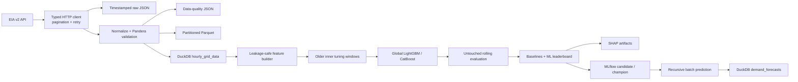

# GridMind

GridMind is an ML-engineering project for dependable electricity-system forecasting and
decision support. Milestone 1 established validated EIA ingestion, Parquet/DuckDB storage, and
deterministic baselines. Milestone 2 adds production-quality 24-hour global demand forecasting
with LightGBM and CatBoost, nested Optuna tuning, SHAP, MLflow Model Registry, and idempotent
batch predictions.

Milestone 2 still deliberately contains **no weather data, solar or wind forecasting,
probabilistic forecasts, deep learning, anomaly detection, battery optimization, online API
serving, dashboard, or cloud deployment**.

## Architecture



The modules are intentionally cohesive: `data` owns API communication, contracts,
normalization, and persistence; `features` owns auditable past-only inputs; `models` owns global
tree adapters and lifecycle operations; `training` owns nested validation and comparison;
`explainability` owns SHAP outputs; `pipelines` orchestrates those components; and `cli.py` is
the user-facing boundary.

## Repository structure

```text
src/gridmind/          Python package
  data/                EIA client, schemas, processing, storage
  features/            Calendar, lag, shifted rolling, and feature contracts
  forecasting/         Baselines, rolling validation, metrics
  models/              LightGBM, CatBoost, bundles, registry promotion
  training/            Dataset adapters, evaluation, Optuna, leaderboard
  explainability/      SHAP importance, plots, and local explanations
  pipelines/           Ingest, baseline, train, predict, and explain orchestration
tests/                 Offline unit and integration tests
data/raw/              Ignored raw API snapshots
data/processed/        Parquet-only canonical partitioned dataset
artifacts/data_quality/ Timestamped ingestion and validation quality reports
artifacts/             Ignored evaluation outputs
mlflow.db              Ignored SQLite MLflow tracking and registry backend
mlartifacts/           Ignored MLflow run and model artifacts
.github/workflows/     CI quality gate
```

## Local setup

Python 3.11 or later is required.

```bash
python3 -m venv .venv
source .venv/bin/activate
python -m pip install -e '.[dev]'
cp .env.example .env
```

Register for an [EIA API key](https://www.eia.gov/opendata/register.php), then set
`EIA_API_KEY` in `.env`. There is intentionally no fake or default key.

## Configuration

| Variable | Purpose | Default |
|---|---|---|
| `EIA_API_KEY` | EIA credential; required only for real ingestion | none |
| `EIA_BASE_URL` | EIA v2 API root | `https://api.eia.gov/v2` |
| `GRID_REGION` | Balancing-authority respondent code | `PJM` |
| `DATA_START_DATE` / `DATA_END_DATE` | Ingestion/evaluation range | none |
| `DATA_DIR` | Raw and processed filesystem root | `data` |
| `DATA_QUALITY_DIR` | Quality-report artifacts outside processed Parquet | `artifacts/data_quality` |
| `DUCKDB_PATH` | Analytical database path | `data/gridmind.duckdb` |
| `MLFLOW_TRACKING_URI` | Tracking and Registry backend | `sqlite:///mlflow.db` |
| `MLFLOW_ARTIFACT_ROOT` | Separate local MLflow artifacts | `mlartifacts` |
| `MLFLOW_ENABLED` | Enable experiment logging | `true` |
| `FORECAST_HORIZON` | Recursive forecast hours | `24` |
| `VALIDATION_WINDOWS` / `VALIDATION_STEP_SIZE` | Final rolling design | `5` / `24` |
| `TUNING_WINDOWS` / `OPTUNA_TRIALS` | Inner tuning design | `4` / `20` |
| `PRIMARY_SELECTION_METRIC` | `mae`, `rmse`, `wape`, `mase`, or `bias` | `wape` |
| `MODEL_RANDOM_SEED` / `MODEL_N_JOBS` | Reproducibility and CPU limit | `42` / `-1` |
| `MLFLOW_MODEL_NAME` | Registry model name | `gridmind-demand-forecast` |
| `MLFLOW_REGISTER_MODEL` | Enable candidate/champion workflow | `true` |
| `MODEL_PROMOTION_THRESHOLD` | Minimum relative baseline improvement | `0.0` |
| `SHAP_SAMPLE_SIZE` | Maximum deterministic explanation sample | `2000` |
| `LOG_LEVEL` | Python logging level | `INFO` |
| `MISSING_DEMAND_POLICY` | Missing actual demand: `error` or `drop` | `error` |

`ENABLE_MLFLOW` is the Milestone 2 spelling; legacy `MLFLOW_ENABLED` remains supported. Milestone
2 defaults to SQLite because experiment hierarchy, logged models, Registry versions, and
candidate/champion aliases require a reliable database-backed store. Explicit SQLite or remote
tracking URIs are preserved. With SQLite configured, GridMind does not inspect the legacy
`./mlruns` file store.

## CLI usage

```bash
gridmind --help
gridmind ingest --region PJM --start-date 2024-01-01 --end-date 2024-03-01
gridmind ingest --region PJM --start-date 2024-01-01 --end-date 2024-03-01 \
  --missing-demand-policy drop
gridmind validate
gridmind inspect
gridmind baseline --region PJM --horizon 24 --windows 3 --step-size 24
gridmind baseline --no-mlflow
gridmind train --region PJM --models lightgbm,catboost --horizon 24 \
  --validation-windows 5 --tune --trials 20
gridmind predict --region PJM --horizon 24 --model-alias champion
gridmind leaderboard
gridmind explain --region PJM --model-alias champion
```

### Ingestion data quality and missing demand

Actual demand is the forecasting target and is never filled or interpolated. The default
`MISSING_DEMAND_POLICY=error` writes a timestamped report under `DATA_QUALITY_DIR`, then stops
before processed Parquet or DuckDB is changed. The error lists the report path and explains how
to opt into quarantine handling.

With `--missing-demand-policy drop`, every affected canonical row is first written unchanged to
`data/quarantine/missing_demand_<timestamp>.parquet`. The artifact contains its UTC timestamp,
region, available forecast demand, net generation, total interchange, and ingestion timestamp.
Only those rows are excluded; the retained frame is strictly validated and then persisted. The
resulting hourly gaps remain explicit, so forecasting features cannot bridge them as if the
observations were consecutive.

Quality reports record the policy, exact missing timestamps, pre-filter count, quarantine count,
retained rows, and resulting gap count.

Each ingestion report also contains a `reconciliation` section covering raw and unique source
measurements, expected and pivoted timestamps, exact and conflicting duplicates, missing demand,
other invalid rows, retained rows, fully absent source timestamps, and any unexplained
difference. Persistence stops when the required pivot-to-retained equation does not reconcile.

`data/processed/` is a Parquet-only Hive-partitioned dataset. Quality JSON, quarantine records,
plots, logs, and other artifacts are stored elsewhere. Processed reads enumerate only
`*.parquet` files, and writes stage and validate a complete idempotent dataset replacement before
swapping it into place, so a failed write leaves the previous valid dataset intact.

### Credential security

Keep `.env` local and never attach or commit it. GridMind does not print or snapshot `.env`, and
the EIA key is excluded from settings serialization. Application logging suppresses routine
`httpx`/`httpcore` request messages and redacts both `api_key=...` query parameters and the
configured key from emitted records. EIA error messages never include request URLs. Raw EIA
response artifacts are also recursively sanitized because the API may echo request parameters.

If a key may previously have appeared in terminal logs or an old raw response artifact, revoke
and replace it through the EIA registration service, then remove the affected logs/artifacts.

`ingest` saves credential-redacted response pages, canonical partitioned Parquet, a quality report,
and an idempotently updated DuckDB table. `validate` exits nonzero on a contract violation.
`baseline` writes all validation predictions and a metric report, then prints an MAE-sorted
leaderboard. `inspect` summarizes DuckDB contents.

`train` creates a parent MLflow run, child model/trial runs, the combined leaderboard, a
reloadable bundle, SHAP artifacts, and candidate/champion decisions. `predict` may load a local
bundle, run ID, version, or registry alias. It fails on insufficient history, unsupported
regions, non-finite output, or negative output. `leaderboard` renders the latest local CSV or a
specific MLflow run. `explain` regenerates sampled SHAP artifacts.

## Canonical data contract

Each row is unique on `(region, timestamp_utc)`, sorted by that key, and uses stable types.
Timestamps are stored as timezone-aware UTC. CLI inspection, reports, and run metadata always
render them in canonical ISO-8601 form with `Z`; display never depends on the host timezone.

| Column | Contract |
|---|---|
| `timestamp_utc` | timezone-aware UTC datetime |
| `region` | balancing-authority string |
| `demand_mw` | non-null, non-negative float |
| `forecast_demand_mw` | nullable float |
| `net_generation_mw` | nullable float |
| `total_interchange_mw` | nullable float |
| `ingestion_timestamp_utc` | timezone-aware UTC datetime |

Missing demand is never imputed. The quality report captures rows, dates, regions, duplicates,
missingness, negative values, and missing hourly timestamps.

## Leakage-safe feature definitions

Calendar inputs—hour, weekday, day, ISO week, month, quarter, weekend, and hour/weekday sine
and cosine—are known in advance. Demand lags default to 1, 2, 3, 6, 12, 24, 48, 72, 168, and
336 hours. Shifted means, standard deviations, minima, and maxima default to 3, 6, 12, 24, 72,
and 168 hours. Region is a categorical static feature, enabling one global model across one or
many regions.

Every target-derived value is timestamp-aware and uses demand no later than `t-1`. Each region
is divided into stable UTC hourly segments, and lag and rolling features are calculated within
those segments only. This prevents a row shift from mistaking an older observation for the
previous hour. Rows without sufficient contiguous history are counted and removed; targets are
never interpolated. Contemporaneous EIA forecast,
generation, and interchange columns are excluded by default because their future availability
has not been established.

The serialized `feature_schema.json` fixes feature names, order, types, lags, rolling windows,
target, entity, hourly frequency, and creation version.

## Validation methodology and baselines

Rolling-origin evaluation uses expanding training history. GridMind searches backward for the
requested number of origins whose complete history and forecast horizon are contiguous for every
region. Invalid origins are skipped and audited; training fails rather than silently reducing the
window count. Training timestamps always precede the following validation window, and validation
demand is attached only after prediction. Horizon, window count, and origin step are configurable.
The continuity summary, selected tuning/final origins, segment IDs, and rejected-origin reasons
are stored in each run's `window_selection.json`.

Four baselines provide honest reference performance:

1. last observed value;
2. seasonal naive at 24 hours;
3. seasonal naive at 168 hours;
4. the average of the 24-hour and 168-hour forecasts.

Seasonal models fail clearly if their exact lagged timestamps are unavailable.

## Global ML forecasting, tuning, and comparison

LightGBM uses an L1 regression objective and categorical region levels. CatBoost uses CPU
execution, MAE loss, quiet output, and categorical region handling. Both receive deterministic
seeds and configurable thread limits. The repository includes an explicit MLForecast adapter
for the same `id_col`, `time_col`, `target_col`, frequency, lags, and date-feature contract,
while GridMind's native feature builder remains authoritative for gap and removal auditing.

The default strategy is recursive: step 1 uses observed history, while later steps may use
earlier predictions as lag/rolling inputs. This provides one reusable model rather than 24
independent horizon models, but errors can accumulate deeper into the horizon.

Optuna sees only older history and inner rolling windows. The latest final windows are reserved
before optimization and used once after parameter selection. Trials optimize mean WAPE by
default, use a seeded TPE sampler, prune failed trials safely, and write history, importance,
summary, and best-parameter artifacts.

The final leaderboard ranks last-value, 24-hour and 168-hour seasonal naive, averaged seasonal
naive, LightGBM, and CatBoost by the configured metric with MAE as the tie-breaker. Negative
relative improvement is retained when ML is worse; it is never presented as a gain.

## Metrics

- **MAE**: mean absolute error in MW; lower is better.
- **RMSE**: square-error-sensitive error in MW; lower is better.
- **WAPE**: absolute error divided by absolute actual demand; scale-free and lower is better.
- **MASE**: MAE relative to a naive change scale; below one is favorable.
- **Forecast bias**: mean prediction minus actual; positive means over-forecasting.

Zero denominators produce an undefined (`null` in JSON) ratio rather than infinity or a crash.
Reports contain overall metrics and each rolling window.

## Testing and quality

Tests use `httpx.MockTransport` and the checked-in JSON fixture; they never call EIA.

```bash
make lint
make typecheck
make coverage
# or all quality gates
make check
```

CI runs Ruff formatting/linting, strict mypy, and pytest with an 85% coverage floor on every
push and pull request. No EIA key is required.

## MLflow

By default each evaluated model creates a local run containing region/date/horizon/window/model
parameters, finite metrics, quality and configuration snapshots, and validation predictions.

```bash
mlflow ui --backend-store-uri sqlite:///mlflow.db --default-artifact-root ./mlartifacts
```

Set `MLFLOW_ENABLED=false` or pass `--no-mlflow` when experiment logging is undesired.

If an older file store is malformed, preserve it for audit and start from the SQLite default:

```bash
mv mlruns mlruns_backup
```

Both directories are ignored by Git. Existing runs are not migrated automatically; the backup
remains available for manual recovery while new experiments use `mlflow.db` and `mlartifacts/`.

### Registry promotion

The best successfully trained ML model is assigned `candidate`. It becomes `champion` only
when its metrics and bias are finite, its bundle reloads and predicts, and it beats the
24-hour seasonal baseline by at least `MODEL_PROMOTION_THRESHOLD`. A rejected challenger does
not alter the existing champion.

### SHAP

The selected tree model writes mean absolute importance, an importance CSV, summary plot,
dependence plots, selected local contribution records, and metadata. Sampling is seeded and
bounded by `SHAP_SAMPLE_SIZE`. SHAP explains model behavior; it does not establish causality.

## Batch forecast contract

`demand_forecasts` stores `region`, `forecast_origin`, `timestamp_utc`, `forecast_step`,
`predicted_demand_mw`, `model_name`, `model_version`, `run_id`, and `created_at_utc`. Its
idempotent key is `(region, forecast_origin, timestamp_utc, model_name, model_version)`, so
repeating the same command replaces matching rows rather than duplicating them. The same output
is saved to Parquet under `artifacts/predictions/`.

## Limitations and roadmap

EIA source revisions and respondent semantics remain upstream concerns. Recursive forecasts
can accumulate error. Local DuckDB and MLflow SQLite are intended for batch/local operation,
not distributed concurrent writers. MASE currently uses first-difference actuals in the
evaluated sample as its scaling series. No negative-output clamp is enabled; invalid model
output fails explicitly.

Planned milestones add weather ingestion, solar and wind forecasting, probabilistic forecasts,
anomaly detection, battery-dispatch optimization, then online serving, dashboards, and cloud
infrastructure only when justified.
