# GridMind

> A production-minded ML engineering project for validated grid forecasting, anomaly review, and simulated battery-dispatch decision support.


GridMind demonstrates the end-to-end engineering behind an energy ML product: API ingestion,
strict validation and quarantine, UTC-aware Parquet/DuckDB storage, chronological forecasting,
MLflow Registry workflows, anomaly/alert lifecycle management, battery optimization, a FastAPI
service, a Streamlit dashboard, metrics, and Docker Compose. It is decision-support software—not
physical grid or battery control.

**Demo in minutes:** install the development environment with `make install`, verify existing
local data with `gridmind inspect`, then run `make api` and `make dashboard`. Full guidance is in
[`docs/DEMO.md`](docs/DEMO.md).

## Problem statement

Electricity-system decisions depend on timely, trustworthy demand, renewable, weather, and
operational-signal data. A credible ML workflow must handle missing observations, revisions,
timestamp gaps, leakage, model lineage, alert state, and physics constraints—not only fit a model.
GridMind is a portfolio-scale implementation of those engineering concerns around regional,
hourly data.

## Key capabilities

- Validated EIA electricity and Open-Meteo weather ingestion with pagination, redacted logging,
  quality reports, duplicate reconciliation, and explicit missing-demand quarantine.
- Canonical UTC Parquet and DuckDB persistence with idempotent writes and gap-aware feature logic.
- LightGBM/CatBoost demand, solar, wind, renewable, and net-load forecasting with chronological
  validation, Optuna tuning, SHAP artifacts, and MLflow candidate/champion aliases.
- Rules, residual, and IsolationForest anomaly detection; transparent severity; immutable,
  idempotent alert lifecycle management.
- SciPy MILP/HiGHS battery-dispatch simulations with SOC, power, reserve, cycle, and continuity
  validation.
- FastAPI, Streamlit, optional local API-key authentication, structured logs, Prometheus metrics,
  pagination, readiness checks, and Docker Compose configuration.

## Architecture

### End-to-end data and ML pipeline

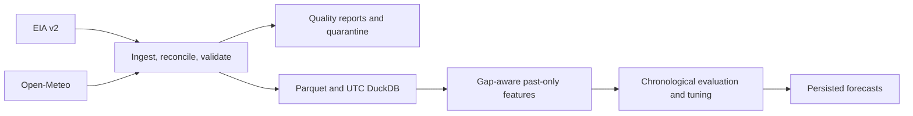

### Forecast training and Model Registry

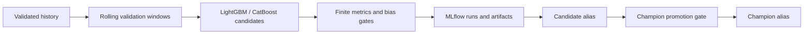

### Anomaly detection and alert lifecycle

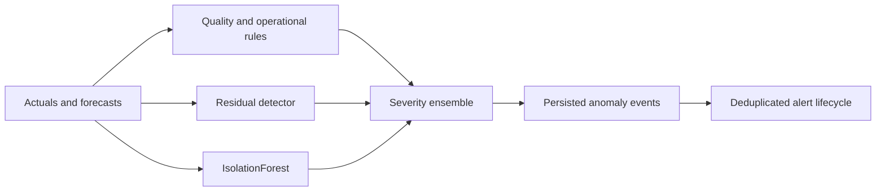

### Battery optimization flow

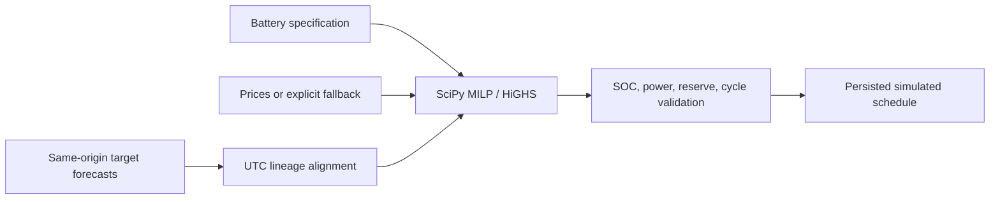

### FastAPI and Streamlit serving architecture

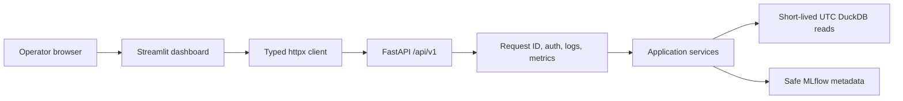

### Docker Compose deployment

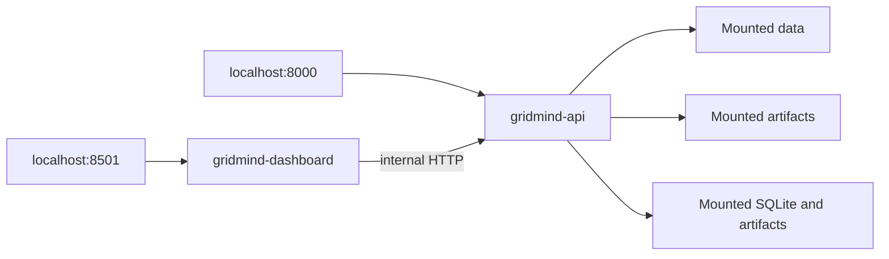

More detail: [`docs/ARCHITECTURE.md`](docs/ARCHITECTURE.md).

## Technology stack

| Area | Technologies |
|---|---|
| Data and storage | EIA API, Open-Meteo, Pandera, pandas, PyArrow, DuckDB |
| Forecasting and MLOps | LightGBM, CatBoost, MLForecast, Optuna, SHAP, MLflow |
| Detection and optimization | scikit-learn, SciPy MILP/HiGHS |
| Serving | FastAPI, Uvicorn, Streamlit, Plotly, httpx, Prometheus client |
| Quality | pytest, pytest-cov, Ruff, strict mypy, GitHub Actions |

## Demonstrated results

These are observed repository experiment outputs in the contexts stated below. They are not
guarantees, production SLAs, real-incident performance, or savings claims.

| Area | Observed result | Evaluation context |
|---|---:|---|
| Demand forecast | LightGBM WAPE ≈ **4.03%** | Chronological demand evaluation |
| Weather-aware demand | LightGBM WAPE ≈ **4.23%** | Chronological evaluation with weather features |
| Solar forecast | CatBoost WAPE ≈ **47.34%** | Chronological regional generation evaluation |
| Wind forecast | LightGBM WAPE ≈ **17.72%** | Chronological regional generation evaluation |
| Net-load forecast | LightGBM WAPE ≈ **4.23%** | Chronological net-load evaluation |
| Anomaly backtest | Precision ≈ **0.4545**, recall ≈ **0.8333**, F1 ≈ **0.5882**, delay ≈ **0.6 h** | Synthetic-injection evaluation; not real-incident performance |
| Battery dispatch | Peak **114,506.428 → 114,406.428 MW** (**100 MW** reduction) | One real 24-hour PJM forecast simulation using SciPy MILP/HiGHS |
| Battery validation | 24 points; no simultaneous charge/discharge; SOC continuity error 0; terminal SOC 250 MWh | Same simulated dispatch; not guaranteed savings or a control instruction |
| Engineering | **200** tests; **88.80%** branch coverage | Offline quality run with strict mypy and Ruff passing |

## Quick start

Python 3.11 or later is required.

```bash
git clone <your-fork-or-repository-url>
cd gridmind
python3 -m venv .venv
source .venv/bin/activate
make install
cp .env.example .env
make quality
```

`make install` installs the full development stack. For leaner deployment images, extras are
available for `forecasting`, `optimization`, `api`, and `dashboard`; see
[`pyproject.toml`](pyproject.toml). Keep API keys in ignored `.env` files only.

## Local API and dashboard demo

With existing local DuckDB data:

```bash
gridmind inspect
make api
```

In another terminal:

```bash
make dashboard
```

Visit `http://localhost:8501` and `http://localhost:8000/docs`. Liveness is public; set
`API_KEY_ENABLED=true` and a local `GRIDMIND_API_KEY` to protect `/api/v1` routes.

```bash
curl http://localhost:8000/health/live
curl http://localhost:8000/health/ready
curl -H 'X-API-Key: example-local-key' \
  'http://localhost:8000/api/v1/forecasts/latest?region=PJM&target=demand_mw&horizon=24'
curl -H 'X-API-Key: example-local-key' 'http://localhost:8000/api/v1/alerts?status=open'
curl -H 'X-API-Key: example-local-key' 'http://localhost:8000/api/v1/dispatches?region=PJM'
curl -H 'X-API-Key: example-local-key' http://localhost:8000/api/v1/models
curl http://localhost:8000/metrics
```

The API route inventory is `/health/live`, `/health/ready`, `/metrics`, and versioned forecasts,
anomalies, alerts, dispatches, and models under `/api/v1`. See [`docs/DEMO.md`](docs/DEMO.md) for
fresh ingestion, authentication, model metadata, and clean shutdown.

## Docker deployment

Docker Compose runs API and dashboard services separately, with mounted data/artifact/MLflow
storage and non-root containers:

```bash
make docker-up
make docker-down
```

Compose serves existing local data; it does not ingest or train models. API readiness requires a
mounted DuckDB database containing `target_forecasts`. Validate the configuration without starting
containers using `docker compose config --quiet`.

## CLI examples

```bash
# EIA ingestion: missing actual demand is quarantined, never filled.
gridmind ingest --region PJM --start-date 2023-01-01 --end-date 2025-12-31 \
  --missing-demand-policy drop

# Weather-aware target training and realistic prediction.
gridmind train-target --target demand_mw --region PJM --no-mlflow
gridmind predict-target --target demand_mw --region PJM --horizon 24 --model-alias champion

# Detection and simulated dispatch. Neither command controls equipment.
gridmind detect-anomalies --region PJM --no-mlflow
gridmind optimize-dispatch --region PJM --battery-id pjm-bess-1 \
  --forecast-origin 2026-07-13T03:00:00Z --horizon 24 --objective peak_shaving --no-mlflow
```

Run `gridmind --help` for the authoritative command and option list.

## MLOps workflow

1. Ingest, reconcile, validate, and preserve quality evidence.
2. Build leakage-safe features and assess chronological windows.
3. Tune only on older windows; hold final evaluation windows untouched.
4. Record parameters, metrics, artifacts, and lineage in SQLite-backed MLflow.
5. Assign a candidate; promote a champion only after finite-metric, bias, reload, and baseline gates.
6. Persist predictions, anomaly events, alerts, and dispatch schedules idempotently.

## Data sources

- [U.S. Energy Information Administration Open Data](https://www.eia.gov/opendata/)
- [Open-Meteo](https://open-meteo.com/)

Provider terms, revisions, licensing, and attribution obligations apply. Read
[`docs/DATA_CARD.md`](docs/DATA_CARD.md) before treating any result as representative.

## Testing and quality

```bash
make quality
make check-secrets
docker compose config --quiet
```

CI uses Python 3.11, pip caching, formatting, linting, strict mypy, an import smoke check, and
offline pytest with branch coverage at or above 85%. `make check-secrets` is a lightweight tracked
file guard, not a substitute for professional secret scanning or history scanning.

## Repository structure

```text
src/gridmind/
  data/           ingestion, contracts, canonical storage
  features/       leakage-safe calendar, lag, rolling, and weather features
  models/         model adapters, serialization, promotion
  anomalies/      detectors, severity, evaluation
  alerts/         lifecycle contracts and persistence
  optimization/   battery physics, MILP, simulation, storage
  services/       API-facing query and lifecycle services
  api/            FastAPI application and routers
  dashboard/      Streamlit dashboard and typed API client
docs/             architecture, demo, model/data/security documentation
tests/            offline unit and integration tests
```

## Screenshots

### Overview Dashboard

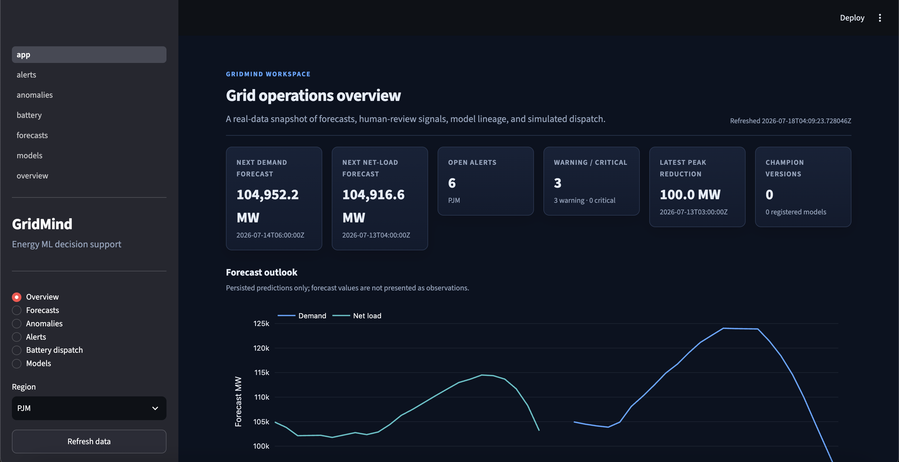

### Forecast Dashboard

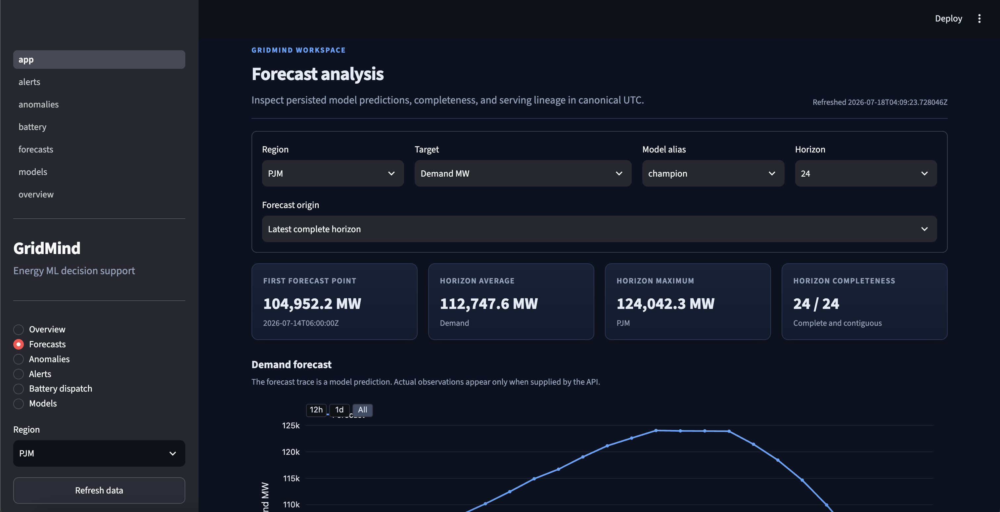

### Anomaly Detection Dashboard

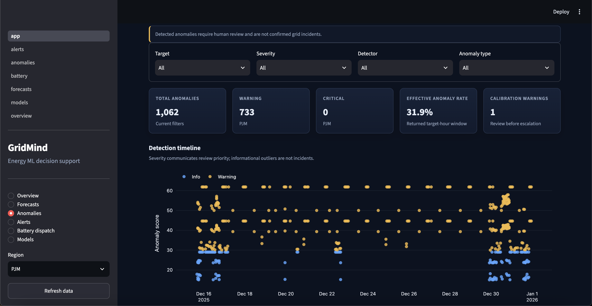

### Battery Dispatch Dashboard

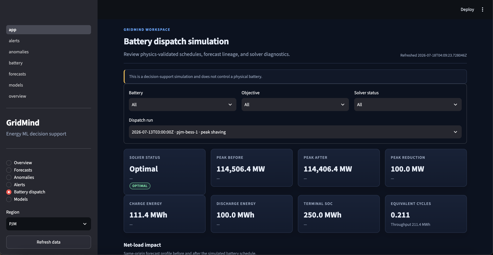

### FastAPI Documentation

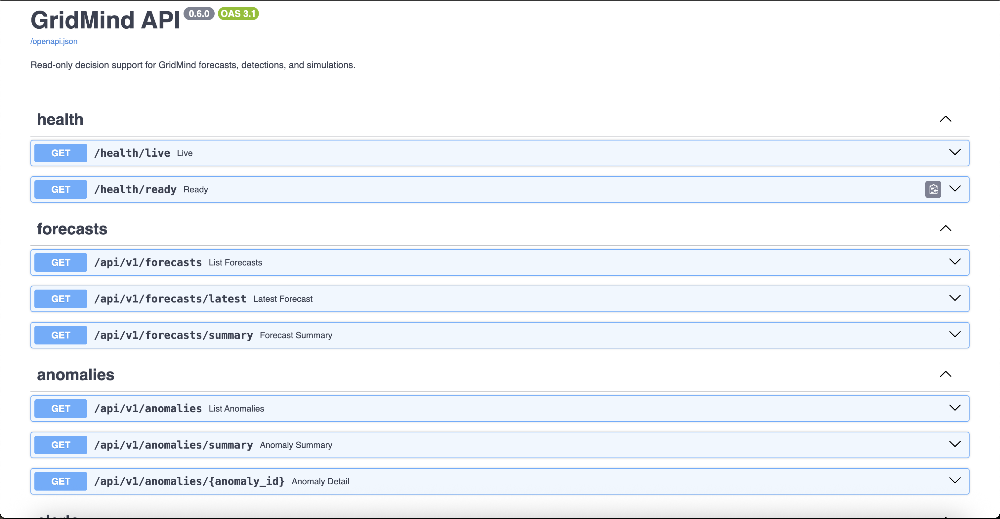

## Limitations and responsible use

- GridMind is decision support. It does not control batteries, markets, grid infrastructure,
  EMS/SCADA systems, or safety-critical equipment.
- Anomaly detections require human review and are not confirmed incidents.
- Battery schedules are simulations, not guaranteed savings, dispatch instructions, or settlement
  calculations.
- Local API-key authentication is not enterprise identity. Production requires TLS, secret
  management, backups, external authentication/authorization, and network controls.
- EIA revisions, weather availability, data coverage, recursive errors, source semantics, and
  incomplete market/network physics limit real-world applicability.

Read [`docs/MODEL_CARD.md`](docs/MODEL_CARD.md) and [`docs/SECURITY.md`](docs/SECURITY.md) for
the detailed model and security boundaries.

## Roadmap

Potential future work includes probabilistic forecasts, calibrated incident evaluation with real
labels, operator-supplied asset models, richer price/network constraints, managed deployment
controls, and external identity. Physical control and public multi-tenant hosting remain out of
scope unless explicit safety, regulatory, and operating requirements are met.

## Licence

GridMind is released under the [MIT License](LICENSE). Contributions are welcome via
[`CONTRIBUTING.md`](CONTRIBUTING.md); changes are recorded in [`CHANGELOG.md`](CHANGELOG.md).
