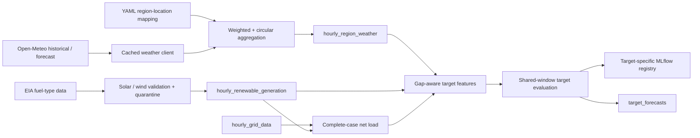
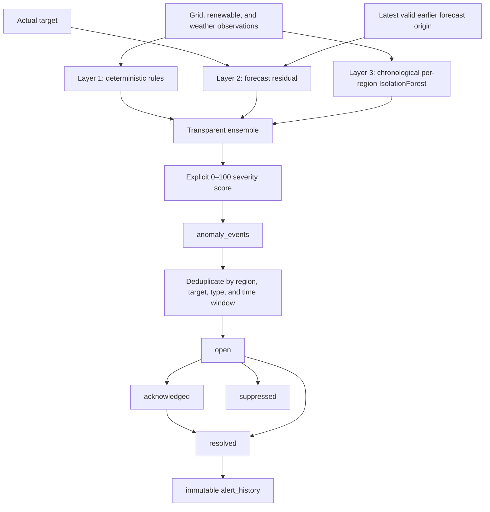
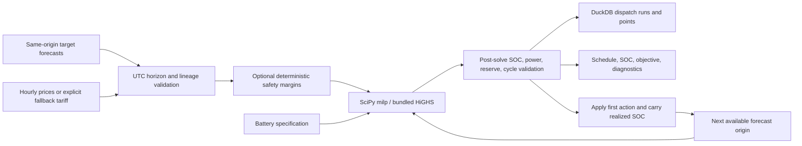

# GridMind

GridMind is an ML-engineering project for dependable electricity-system forecasting, anomaly
detection, and decision support. Milestones 1–3 established validated EIA/Open-Meteo ingestion,
Parquet/DuckDB storage, deterministic baselines, weather-aware LightGBM/CatBoost forecasts,
renewable and net-load targets, Optuna, SHAP, MLflow Model Registry, and idempotent predictions.
Milestone 4 adds a production-quality three-layer anomaly and alerting workflow. Milestone 5 adds
forecast-aligned battery dispatch optimization and rolling decision-support simulation while
preserving all earlier interfaces.

GridMind still deliberately contains **no physical battery control, SCADA integration, online
API, dashboard, Kafka, Kubernetes, cloud infrastructure, or live dispatch commands**.

## Architecture

```mermaid
flowchart LR
    EIA["EIA v2 API"] --> Client["Typed HTTP client<br/>pagination + retry"]
    Client --> Raw["Timestamped raw JSON"]
    Client --> Process["Normalize + Pandera validation"]
    Process --> Quality["Data-quality JSON"]
    Process --> Parquet["Partitioned Parquet"]
    Process --> DuckDB["DuckDB hourly_grid_data"]
    DuckDB --> Features["Leakage-safe feature builder"]
    Features --> Tuning["Older inner tuning windows"]
    Tuning --> Models["Global LightGBM / CatBoost"]
    Models --> Final["Untouched rolling evaluation"]
    Final --> Compare["Baselines + ML leaderboard"]
    Compare --> SHAP["SHAP artifacts"]
    Compare --> Registry["MLflow candidate / champion"]
    Registry --> Batch["Recursive batch prediction"]
    Batch --> Forecasts["DuckDB demand_forecasts"]
    DuckDB --> Rules["Data-quality rules"]
    Forecasts --> Residuals["Leakage-safe residual detector"]
    DuckDB --> IF["Per-region IsolationForest"]
    Rules --> Ensemble["Transparent severity ensemble"]
    Residuals --> Ensemble
    IF --> Ensemble
    Ensemble --> Alerts["Deduplicated alert lifecycle"]
    Forecasts --> BatteryMILP["HiGHS battery dispatch MILP"]
    BatteryMILP --> Dispatch["Validated dispatch schedules"]
    Dispatch --> Rolling["Leakage-safe rolling simulation"]
```



The modules are intentionally cohesive: `data` owns API communication, contracts,
normalization, and persistence; `features` owns auditable past-only inputs; `models` owns global
tree adapters and lifecycle operations; `training` owns nested validation and comparison;
`explainability` owns SHAP outputs; `pipelines` orchestrates those components; and `cli.py` is
the user-facing boundary.

## Repository structure

```text
src/gridmind/          Python package
  data/                EIA client, schemas, processing, storage
  features/            Calendar, lag, shifted rolling, and feature contracts
  forecasting/         Baselines, rolling validation, metrics
  models/              LightGBM, CatBoost, bundles, registry promotion
  training/            Dataset adapters, evaluation, Optuna, leaderboard
  explainability/      SHAP importance, plots, and local explanations
  anomalies/           Rules, residuals, IsolationForest, ensemble, severity, evaluation
  alerts/              Alert contracts, lifecycle, DuckDB persistence
  optimization/        Battery physics, HiGHS MILP, baselines, simulation, metrics, storage
  pipelines/           Ingest, baseline, train, predict, and explain orchestration
tests/                 Offline unit and integration tests
data/raw/              Ignored raw API snapshots
data/processed/        Parquet-only canonical partitioned dataset
artifacts/data_quality/ Timestamped ingestion and validation quality reports
artifacts/             Ignored evaluation outputs
mlflow.db              Ignored SQLite MLflow tracking and registry backend
mlartifacts/           Ignored MLflow run and model artifacts
.github/workflows/     CI quality gate
```

## Local setup

Python 3.11 or later is required.

```bash
python3 -m venv .venv
source .venv/bin/activate
python -m pip install -e '.[dev]'
cp .env.example .env
```

Register for an [EIA API key](https://www.eia.gov/opendata/register.php), then set
`EIA_API_KEY` in `.env`. There is intentionally no fake or default key.

## Configuration

| Variable | Purpose | Default |
|---|---|---|
| `EIA_API_KEY` | EIA credential; required only for real ingestion | none |
| `EIA_BASE_URL` | EIA v2 API root | `https://api.eia.gov/v2` |
| `GRID_REGION` | Balancing-authority respondent code | `PJM` |
| `DATA_START_DATE` / `DATA_END_DATE` | Ingestion/evaluation range | none |
| `DATA_DIR` | Raw and processed filesystem root | `data` |
| `DATA_QUALITY_DIR` | Quality-report artifacts outside processed Parquet | `artifacts/data_quality` |
| `DUCKDB_PATH` | Analytical database path | `data/gridmind.duckdb` |
| `MLFLOW_TRACKING_URI` | Tracking and Registry backend | `sqlite:///mlflow.db` |
| `MLFLOW_ARTIFACT_ROOT` | Separate local MLflow artifacts | `mlartifacts` |
| `MLFLOW_ENABLED` | Enable experiment logging | `true` |
| `FORECAST_HORIZON` | Recursive forecast hours | `24` |
| `VALIDATION_WINDOWS` / `VALIDATION_STEP_SIZE` | Final rolling design | `5` / `24` |
| `TUNING_WINDOWS` / `OPTUNA_TRIALS` | Inner tuning design | `4` / `20` |
| `PRIMARY_SELECTION_METRIC` | `mae`, `rmse`, `wape`, `mase`, or `bias` | `wape` |
| `MODEL_RANDOM_SEED` / `MODEL_N_JOBS` | Reproducibility and CPU limit | `42` / `-1` |
| `MLFLOW_MODEL_NAME` | Registry model name | `gridmind-demand-forecast` |
| `MLFLOW_REGISTER_MODEL` | Enable candidate/champion workflow | `true` |
| `MODEL_PROMOTION_THRESHOLD` | Minimum relative baseline improvement | `0.0` |
| `SHAP_SAMPLE_SIZE` | Maximum deterministic explanation sample | `2000` |
| `LOG_LEVEL` | Python logging level | `INFO` |
| `MISSING_DEMAND_POLICY` | Missing actual demand: `error` or `drop` | `error` |
| `ANOMALY_LOOKBACK_HOURS` / `ANOMALY_MIN_TRAINING_ROWS` | Chronological detector history | `720` / `336` |
| `ANOMALY_CONTAMINATION` / `ANOMALY_RANDOM_SEED` | IsolationForest configuration | `0.01` / `42` |
| `ISOLATION_*_SCORE_QUANTILE` | Per-target demand/solar/wind/net-load score cutoffs | `0.995` / `0.995` / `0.995` / `0.999` |
| `ISOLATION_EXTREME_SCORE_QUANTILE` / `ANOMALY_MAX_RATE` | Standalone warning cutoff / calibration guard | `0.9995` / `0.10` |
| `FLATLINE_HOURS` / `FLATLINE_TOLERANCE` | Consecutive support and numeric equality tolerance | `4` / `0` |
| `SOLAR_DAYLIGHT_RADIATION_THRESHOLD_WM2` | Radiation required for solar operational rules | `25` |
| `SOLAR_MIN_EXPECTED_GENERATION_MW` / `SOLAR_MIN_ABSOLUTE_DROP_MW` | Solar drop eligibility gates | `100` / `100` |
| `SOLAR_MIN_DROP_DURATION_HOURS` | Consecutive daylight underproduction required | `2` |
| `ALERT_DEDUP_WINDOW_HOURS` / `ALERT_AUTO_RESOLVE_HOURS` | Alert lifecycle windows | `6` / `24` |
| `ANOMALY_EXPERIMENT_NAME` | MLflow anomaly experiment | `gridmind-anomaly-detection` |
| `BATTERY_CAPACITY_MWH` / `BATTERY_MAX_*_MW` | Illustrative energy and charge/discharge limits | `500` / `100` |
| `BATTERY_MIN_SOC_MWH` / `BATTERY_MAX_SOC_MWH` | Allowed stored-energy interval | `50` / `500` |
| `BATTERY_INITIAL_SOC_MWH` / `BATTERY_TERMINAL_SOC_MWH` | Horizon boundary SOC | `250` / `250` |
| `BATTERY_*_EFFICIENCY` / `BATTERY_SELF_DISCHARGE_PER_HOUR` | Simplified battery physics | `0.95` / `0.0001` |
| `BATTERY_MAX_EQUIVALENT_CYCLES_PER_DAY` | Per-UTC-day throughput limit | `1.5` |
| `DISPATCH_HORIZON_HOURS` / `DISPATCH_STEP_HOURS` | Optimization horizon and interval | `24` / `1` |
| `FALLBACK_ENERGY_PRICE_PER_MWH` | Explicit flat tariff if price data are unavailable | none |
| `ROBUST_DEMAND_UPLIFT_PCT` / `ROBUST_RENEWABLE_REDUCTION_PCT` | Conservative deterministic margins | `0.03` / `0.10` |
| `ROBUST_EXTRA_RESERVE_PCT` | Additional conservative SOC reserve | `0.05` |
| `BATTERY_EXPERIMENT_NAME` | MLflow dispatch/backtest experiment | `gridmind-battery-optimization` |

`ENABLE_MLFLOW` is the Milestone 2 spelling; legacy `MLFLOW_ENABLED` remains supported. Milestone
2 defaults to SQLite because experiment hierarchy, logged models, Registry versions, and
candidate/champion aliases require a reliable database-backed store. Explicit SQLite or remote
tracking URIs are preserved. With SQLite configured, GridMind does not inspect the legacy
`./mlruns` file store.

## CLI usage

```bash
gridmind --help
gridmind ingest --region PJM --start-date 2024-01-01 --end-date 2024-03-01
gridmind ingest --region PJM --start-date 2024-01-01 --end-date 2024-03-01 \
  --missing-demand-policy drop
gridmind validate
gridmind inspect
gridmind baseline --region PJM --horizon 24 --windows 3 --step-size 24
gridmind baseline --no-mlflow
gridmind train --region PJM --models lightgbm,catboost --horizon 24 \
  --validation-windows 5 --tune --trials 20
gridmind predict --region PJM --horizon 24 --model-alias champion
gridmind leaderboard
gridmind explain --region PJM --model-alias champion
```

### Ingestion data quality and missing demand

Actual demand is the forecasting target and is never filled or interpolated. The default
`MISSING_DEMAND_POLICY=error` writes a timestamped report under `DATA_QUALITY_DIR`, then stops
before processed Parquet or DuckDB is changed. The error lists the report path and explains how
to opt into quarantine handling.

With `--missing-demand-policy drop`, every affected canonical row is first written unchanged to
`data/quarantine/missing_demand_<timestamp>.parquet`. The artifact contains its UTC timestamp,
region, available forecast demand, net generation, total interchange, and ingestion timestamp.
Only those rows are excluded; the retained frame is strictly validated and then persisted. The
resulting hourly gaps remain explicit, so forecasting features cannot bridge them as if the
observations were consecutive.

Quality reports record the policy, exact missing timestamps, pre-filter count, quarantine count,
retained rows, and resulting gap count.

Each ingestion report also contains a `reconciliation` section covering raw and unique source
measurements, expected and pivoted timestamps, exact and conflicting duplicates, missing demand,
other invalid rows, retained rows, fully absent source timestamps, and any unexplained
difference. Persistence stops when the required pivot-to-retained equation does not reconcile.

`data/processed/` is a Parquet-only Hive-partitioned dataset. Quality JSON, quarantine records,
plots, logs, and other artifacts are stored elsewhere. Processed reads enumerate only
`*.parquet` files, and writes stage and validate a complete idempotent dataset replacement before
swapping it into place, so a failed write leaves the previous valid dataset intact.

### Credential security

Keep `.env` local and never attach or commit it. GridMind does not print or snapshot `.env`, and
the EIA key is excluded from settings serialization. Application logging suppresses routine
`httpx`/`httpcore` request messages and redacts both `api_key=...` query parameters and the
configured key from emitted records. EIA error messages never include request URLs. Raw EIA
response artifacts are also recursively sanitized because the API may echo request parameters.

If a key may previously have appeared in terminal logs or an old raw response artifact, revoke
and replace it through the EIA registration service, then remove the affected logs/artifacts.

`ingest` saves credential-redacted response pages, canonical partitioned Parquet, a quality report,
and an idempotently updated DuckDB table. `validate` exits nonzero on a contract violation.
`baseline` writes all validation predictions and a metric report, then prints an MAE-sorted
leaderboard. `inspect` summarizes DuckDB contents.

`train` creates a parent MLflow run, child model/trial runs, the combined leaderboard, a
reloadable bundle, SHAP artifacts, and candidate/champion decisions. `predict` may load a local
bundle, run ID, version, or registry alias. It fails on insufficient history, unsupported
regions, non-finite output, or negative output. `leaderboard` renders the latest local CSV or a
specific MLflow run. `explain` regenerates sampled SHAP artifacts.

## Canonical data contract

Each row is unique on `(region, timestamp_utc)`, sorted by that key, and uses stable types.
Timestamps are stored as timezone-aware UTC. CLI inspection, reports, and run metadata always
render them in canonical ISO-8601 form with `Z`; display never depends on the host timezone.

| Column | Contract |
|---|---|
| `timestamp_utc` | timezone-aware UTC datetime |
| `region` | balancing-authority string |
| `demand_mw` | non-null, non-negative float |
| `forecast_demand_mw` | nullable float |
| `net_generation_mw` | nullable float |
| `total_interchange_mw` | nullable float |
| `ingestion_timestamp_utc` | timezone-aware UTC datetime |

Missing demand is never imputed. The quality report captures rows, dates, regions, duplicates,
missingness, negative values, and missing hourly timestamps.

## Leakage-safe feature definitions

Calendar inputs—hour, weekday, day, ISO week, month, quarter, weekend, and hour/weekday sine
and cosine—are known in advance. Demand lags default to 1, 2, 3, 6, 12, 24, 48, 72, 168, and
336 hours. Shifted means, standard deviations, minima, and maxima default to 3, 6, 12, 24, 72,
and 168 hours. Region is a categorical static feature, enabling one global model across one or
many regions.

Every target-derived value is timestamp-aware and uses demand no later than `t-1`. Each region
is divided into stable UTC hourly segments, and lag and rolling features are calculated within
those segments only. This prevents a row shift from mistaking an older observation for the
previous hour. Rows without sufficient contiguous history are counted and removed; targets are
never interpolated. Contemporaneous EIA forecast,
generation, and interchange columns are excluded by default because their future availability
has not been established.

The serialized `feature_schema.json` fixes feature names, order, types, lags, rolling windows,
target, entity, hourly frequency, and creation version.

## Validation methodology and baselines

Rolling-origin evaluation uses expanding training history. GridMind searches backward for the
requested number of origins whose complete history and forecast horizon are contiguous for every
region. Invalid origins are skipped and audited; training fails rather than silently reducing the
window count. Training timestamps always precede the following validation window, and validation
demand is attached only after prediction. Horizon, window count, and origin step are configurable.
The continuity summary, selected tuning/final origins, segment IDs, and rejected-origin reasons
are stored in each run's `window_selection.json`.

Four baselines provide honest reference performance:

1. last observed value;
2. seasonal naive at 24 hours;
3. seasonal naive at 168 hours;
4. the average of the 24-hour and 168-hour forecasts.

Seasonal models fail clearly if their exact lagged timestamps are unavailable.

## Global ML forecasting, tuning, and comparison

LightGBM uses an L1 regression objective and categorical region levels. CatBoost uses CPU
execution, MAE loss, quiet output, and categorical region handling. Both receive deterministic
seeds and configurable thread limits. The repository includes an explicit MLForecast adapter
for the same `id_col`, `time_col`, `target_col`, frequency, lags, and date-feature contract,
while GridMind's native feature builder remains authoritative for gap and removal auditing.

The default strategy is recursive: step 1 uses observed history, while later steps may use
earlier predictions as lag/rolling inputs. This provides one reusable model rather than 24
independent horizon models, but errors can accumulate deeper into the horizon.

Optuna sees only older history and inner rolling windows. The latest final windows are reserved
before optimization and used once after parameter selection. Trials optimize mean WAPE by
default, use a seeded TPE sampler, prune failed trials safely, and write history, importance,
summary, and best-parameter artifacts.

The final leaderboard ranks last-value, 24-hour and 168-hour seasonal naive, averaged seasonal
naive, LightGBM, and CatBoost by the configured metric with MAE as the tie-breaker. Negative
relative improvement is retained when ML is worse; it is never presented as a gain.

## Metrics

- **MAE**: mean absolute error in MW; lower is better.
- **RMSE**: square-error-sensitive error in MW; lower is better.
- **WAPE**: absolute error divided by absolute actual demand; scale-free and lower is better.
- **MASE**: MAE relative to a naive change scale; below one is favorable.
- **Forecast bias**: mean prediction minus actual; positive means over-forecasting.

Zero denominators produce an undefined (`null` in JSON) ratio rather than infinity or a crash.
Reports contain overall metrics and each rolling window.

## Milestone 3: weather, renewables, and net load

Milestone 3 adds cached Open-Meteo historical/forecast ingestion, weighted regional weather,
EIA solar and wind targets, and independent forecasting for demand, solar, wind, total
renewables, and net load. Existing Milestone 1/2 demand commands and the original demand
registry remain unchanged.



### Weather mapping and leakage modes

Locations are configured in `configs/grid_locations.yaml`; adding a region does not require a
Python change. PJM uses Philadelphia, Pittsburgh, Baltimore, and Washington, DC as representative
major load centers. Their weights are modelling assumptions—not population or load measurements—
and are normalized on load. Latitude, longitude, positive weights, unique names, mapping version,
source, and rationale are validated.

`realistic_forecast` is the default experiment mode and accepts only forecast-labelled weather.
When archived forecasts are unavailable during training, GridMind can create a documented 24-hour
weather-persistence simulation using only information available at `t-24`. `historical_oracle`
uses observed contemporaneous weather and is always labelled separately. The modes are never
mixed in one leaderboard. Weather lags and rolling statistics restart at UTC timestamp gaps.

### Renewable and net-load targets

EIA `SUN`/solar and `WND`/wind records map to explicit nullable targets. Missing generation is
never assumed to be zero; negative source rows are quarantined. Total renewable generation exists
only when both component values exist. Net load is computed only on complete overlap:

```text
net_load_mw = demand_mw - total_renewable_generation_mw
```

Net load may be negative. Direct LightGBM/CatBoost forecasts are compared with a component method
that forecasts demand, solar, and wind on the same validation windows before subtraction. Solar
and wind forecasts use an explicit non-negative clipping policy whose activation count is reported.

### Milestone 3 commands

```bash
gridmind weather-ingest --region PJM --start-date 2023-01-01 --end-date 2025-12-31
gridmind weather-ingest --region PJM --start-date 2026-07-13 --end-date 2026-07-19 --data-type forecast
gridmind renewables-ingest --region PJM --start-date 2023-01-01 --end-date 2025-12-31

gridmind train-target --target demand_mw --region PJM \
  --weather-mode realistic_forecast --models lightgbm,catboost
gridmind train-target --target solar_generation_mw --region PJM
gridmind train-target --target wind_generation_mw --region PJM
gridmind train-target --target net_load_mw --region PJM \
  --net-load-method direct,component

gridmind predict-target --target net_load_mw --region PJM --horizon 24 \
  --model-alias champion
gridmind target-leaderboard --target net_load_mw
```

Target models use separate registry names and independent candidate/champion aliases. The
weather-demand registry does not overwrite the Milestone 2 demand champion. Promotion requires
finite metrics and bias, bundle reload, valid predictions/output constraints, and improvement over
the target's reference baseline.

### Milestone 3 storage and quality artifacts

| Data | Location |
|---|---|
| Raw weather cache | `data/weather/raw/*.json` |
| Processed weather Parquet | `data/weather/processed/` |
| Location weather | DuckDB `hourly_location_weather` |
| Regional weather | DuckDB `hourly_region_weather` |
| Renewable Parquet | `data/renewables/processed/` |
| Renewable generation | DuckDB `hourly_renewable_generation` |
| Complete-case net load | DuckDB view `target_net_load` |
| Shared target forecasts | DuckDB `target_forecasts` |
| Weather/renewable reports | `artifacts/data_quality/` |
| Target training artifacts | `artifacts/training_targets/<target>/<timestamp>/` |

Coverage reports include weather gaps/duplicates/missing variables, mapping version, cache hits,
renewable gaps/missing components/quarantine, demand-renewable overlap, and net-load availability.

### Current Milestone 3 limitations

- Open-Meteo forecast ingestion stores provider forecasts but does not yet reconstruct historical
  forecast vintages; realistic historical evaluation therefore uses stored archives when present
  or the labelled persistence simulation.
- Region-location weights are documented representative assumptions and should be recalibrated
  against subregional load before operational use.
- Recursive tree forecasts can accumulate error at deeper horizons.
- Battery dispatch, online API serving, dashboards, Kafka, Kubernetes, cloud deployment, deep
  learning, and LLM assistants remain outside Milestones 1–4.

## Milestone 4: anomaly detection and alerts

Milestone 4 evaluates operational observations without silently repairing them. Raw detector
events remain separate from alerts, and every event has a deterministic natural-key identifier,
UTC timestamp, model lineage where relevant, numeric score, explanation, and JSON detector
contributions.



### Three detector layers

The rule detector checks missing, duplicate, non-monotonic and unexpected hourly timestamps;
invalid signs and non-finite measurements; impossible humidity, cloud, and radiation ranges;
abrupt demand/renewable changes; flatlines; stale data; and grid/weather coverage mismatches.
Rules never interpolate or mutate source data. Solar drop and flatline rules require measured
daylight radiation, sufficient expected production, an absolute and relative loss, and the
configured consecutive duration, so normal darkness and sunset ramps are not incidents. A
four-hour flatline means four consecutive hourly observations within the configured tolerance;
the supporting start, end, count, duration, tolerance, and minimum are retained in event metadata.

The residual detector aligns each actual with the latest stored forecast whose origin is strictly
earlier than the target timestamp. Rolling mean, standard deviation, median, MAD, z-score, and
robust MAD score use only earlier residuals. Missing actuals/predictions and insufficient-history
rows are reported but not scored. Solar anomalies are scored separately from non-daylight
low-generation periods, and forecast model/version/run lineage is preserved.

IsolationForest uses deterministic seeds, an explicit feature order, and independent regional
models. Training data chronologically precedes scoring data; incomplete feature rows are counted
and excluded rather than imputed. Bundles and schemas record their regional training cutoff.
Feature-deviation summaries describe association only—they are not causal explanations. The
configured contamination is an algorithm parameter, not evidence of real anomaly prevalence.
Each target has its own training-score quantile and recorded fitted/scoring score distributions.
Standalone detections remain informational unless they exceed the separate extreme quantile;
independent detector agreement can elevate the ensemble. The maximum-rate guard reports excessive
flagging for calibration review without suppressing observations or calling them failures.

### Ensemble and severity

Individual events are not hidden. The ensemble stores each detector, anomaly type, score,
severity, identifier, and source metadata. A critical deterministic rule or residual result is a
critical override; two warning votes elevate a warning; IsolationForest alone remains info or
warning depending on its score; rule/residual agreement increases detector agreement.

The normalized severity formula is explicit: magnitude contributes 45 points, duration 15,
detector agreement 20, target importance 10, recurrence 5, and incomplete data may subtract up
to 5. Scores `0–29` are info, `30–69` warning, and `70–100` critical.

### Alert lifecycle and DuckDB

`anomaly_events` stores idempotent raw and ensemble events. `grid_alerts` stores current alert
state, while `alert_history` preserves every opening, occurrence, acknowledgement, suppression,
manual resolution, and healthy-period automatic resolution. Repeated anomalies inside
`ALERT_DEDUP_WINDOW_HOURS` increment occurrence count; severity may escalate but an active
critical alert is never automatically downgraded. Reprocessing the same anomaly identifier is
idempotent. Alert history is written only for committed meaningful state changes; `updated_at_utc`
alone is excluded from state fingerprints, and deterministic history identifiers make duplicate
insertion a no-op. CLI lifecycle counts distinguish opened, updated, unchanged, acknowledged,
resolved, suppressed, and auto-resolved transitions. All tables and queries use UTC DuckDB
sessions.

### Commands

```bash
gridmind detect-anomalies --region PJM \
  --targets demand_mw,solar_generation_mw,wind_generation_mw,net_load_mw \
  --start-date 2026-07-01 --end-date 2026-07-14 \
  --detectors rules,residual,isolation_forest

gridmind anomaly-backtest --region PJM --target demand_mw \
  --start-date 2025-01-01 --end-date 2025-12-31 --inject --seed 42

gridmind anomalies --region PJM --severity warning --start-date 2026-07-01
gridmind anomalies --region PJM --csv artifacts/anomalies/pjm_events.csv
gridmind alerts --status open --severity critical
gridmind alert-update --alert-id <alert-id> --status acknowledged
```

Commands print evaluated/detected counts, severity and detector distributions, alert changes,
metrics where labels exist, and artifact paths. `--no-mlflow` keeps detection and backtesting
fully local without tracking.

### Backtesting, artifacts, and limitations

Backtests inject deterministic single/multi-hour spikes or drops, solar collapse, wind spike,
flatline, missing hours, weather corruption, gradual drift, and contextual anomalies into a deep
copy of historical data. They report precision, recall, F1, delay, false positives per day,
severity accuracy, and per-type recall under `artifacts/anomaly_backtests/<timestamp>/`. Original
Parquet and DuckDB observations are never changed. Detection outputs, detector schema, thresholds,
events, alert summaries, `anomaly_rate_report.csv`, and `lifecycle_summary.json` are stored under
`artifacts/anomalies/<timestamp>/`, outside all partitioned data directories. The anomaly-rate
report groups UTC-day event counts and rates by target, detector, type, and severity and includes
lifecycle outcomes and effective IsolationForest rates.

When enabled, MLflow experiment `gridmind-anomaly-detection` logs date/region/target scope,
thresholds, IsolationForest parameters, training/excluded rows, metrics, detector bundle, feature
schema, package/Python version, Git commit, and report artifacts. Secrets and `.env` contents are
never logged.

**Synthetic anomaly labels are controlled test cases, not real incidents. Unsupervised anomaly
scores do not prove a grid or system failure. Human review is required before operational action.**
Synthetic-injection metrics must not be presented as performance on real labelled incidents.
Online email/Slack/SMS delivery is not included.

## Milestone 5: battery dispatch decision support

Milestone 5 converts aligned demand, solar, wind, renewable, and net-load forecasts into a
simulated battery schedule. It never communicates with a battery, inverter, EMS, SCADA system,
or market. Battery parameters in `.env.example` are illustrative unless an operator supplies and
validates them.



### Battery model and MILP

For interval duration `dt`, GridMind enforces:

```text
soc_end = soc_start * (1 - self_discharge_rate)^dt
          + charge_mw * charge_efficiency * dt
          - discharge_mw / discharge_efficiency * dt
```

Charge and discharge are non-negative, and `net_battery_power_mw = discharge_mw - charge_mw`.
Binary variables prevent simultaneous charging and discharging. Linear constraints enforce power,
minimum/maximum/reserve SOC, initial and terminal SOC, chronological continuity, and maximum
equivalent cycles for each UTC day. Solver output is not clipped: any tolerance-exceeding physics
violation fails the workflow.

The supported objectives are `peak_shaving`, `energy_arbitrage`, `renewable_utilization`, and
`balanced`. Peak shaving uses an explicit horizon-peak variable. Arbitrage requires supplied
hourly prices or the explicitly configured fallback tariff. Renewable utilization rewards
renewable-aligned charging; it does **not** claim curtailment reduction because this milestone does
not model a curtailment/export limit. Balanced mode uses configured normalized weights, and every
objective contribution is stored separately. Degradation is a simplified linear throughput cost.

### Rolling evaluation, baselines, and robustness

Rolling simulation optimizes a full horizon, applies only its first action, carries the resulting
SOC, advances to the next contiguous forecast origin, and re-optimizes. `forecast_based` mode uses
only predictions available at each origin. `oracle` mode replaces forecast inputs with explicitly
supplied future actuals and is an upper-bound research comparison that is **not deployable**.
Missing origins, timestamp gaps, incomplete horizons, and incompatible model lineage fail clearly.

The no-battery baseline uses zero power. The deterministic rule baseline charges at forecast-known
low-load or renewable-surplus periods and discharges above the forecast-known high-load threshold,
while observing physical limits. Optional `--robust` mode transparently applies demand uplift,
renewable reduction, and additional reserve margins while retaining original values in metadata.
These are conservative deterministic adjustments, not probabilistic optimization.

```bash
gridmind optimize-dispatch --region PJM --battery-id pjm-bess-1 \
  --forecast-origin 2026-07-13T03:00:00Z --horizon 24 \
  --objective peak_shaving --model-alias champion --no-mlflow

gridmind battery-backtest --region PJM --battery-id pjm-bess-1 \
  --start-date 2025-12-01 --end-date 2025-12-31 \
  --objective balanced --mode forecast_based --fallback-energy-price 50 --no-mlflow

gridmind dispatches --region PJM --battery-id pjm-bess-1 --start-date 2026-07-01
```

`battery_dispatch_runs` and `battery_dispatch_points` use deterministic run identifiers, UTC
timestamps, configuration JSON, and forecast/model lineage JSON. `battery_backtest_runs` and
`battery_backtest_metrics` store idempotent strategy comparisons. Artifacts live under
`artifacts/battery_dispatch/<run-id>/` and `artifacts/battery_backtests/<run-id>/`. When enabled,
the `gridmind-battery-optimization` MLflow experiment records the specification, weights, solver
diagnostics, safety margins, metrics, schedule, SOC trajectory, lineage, Git revision, and package
versions without logging secrets or `.env` contents.

This system does not control a physical battery. Results are decision-support simulations, not
guaranteed savings or dispatch instructions. Oracle results are non-deployable. Market settlement,
network power flow, interconnection, telemetry latency, ancillary services, regulatory rules, and
detailed electrochemical degradation are not fully modelled.

## Testing and quality

Tests use `httpx.MockTransport` and the checked-in JSON fixture; they never call EIA.

```bash
make lint
make typecheck
make coverage
# or all quality gates
make check
```

Coverage uses the branch-enabled configuration in `pyproject.toml`. The CI workflow and
`make coverage` run `coverage erase`, remove any remaining `.coverage*` subprocess databases,
and pass that configuration explicitly, preventing statement-only data from being combined with
branch data.

CI runs Ruff formatting/linting, strict mypy, and pytest with an 85% coverage floor on every
push and pull request. No EIA key is required.

## MLflow

By default each evaluated model creates a local run containing region/date/horizon/window/model
parameters, finite metrics, quality and configuration snapshots, and validation predictions.

```bash
mlflow ui --backend-store-uri sqlite:///mlflow.db --default-artifact-root ./mlartifacts
```

Set `MLFLOW_ENABLED=false` or pass `--no-mlflow` when experiment logging is undesired.

If an older file store is malformed, preserve it for audit and start from the SQLite default:

```bash
mv mlruns mlruns_backup
```

Both directories are ignored by Git. Existing runs are not migrated automatically; the backup
remains available for manual recovery while new experiments use `mlflow.db` and `mlartifacts/`.

### Registry promotion

The best successfully trained ML model is assigned `candidate`. It becomes `champion` only
when its metrics and bias are finite, its bundle reloads and predicts, and it beats the
24-hour seasonal baseline by at least `MODEL_PROMOTION_THRESHOLD`. A rejected challenger does
not alter the existing champion.

### SHAP

The selected tree model writes mean absolute importance, an importance CSV, summary plot,
dependence plots, selected local contribution records, and metadata. Sampling is seeded and
bounded by `SHAP_SAMPLE_SIZE`. SHAP explains model behavior; it does not establish causality.

## Batch forecast contract

`demand_forecasts` stores `region`, `forecast_origin`, `timestamp_utc`, `forecast_step`,
`predicted_demand_mw`, `model_name`, `model_version`, `run_id`, and `created_at_utc`. Its
idempotent key is `(region, forecast_origin, timestamp_utc, model_name, model_version)`, so
repeating the same command replaces matching rows rather than duplicating them. The same output
is saved to Parquet under `artifacts/predictions/`.

## Limitations and roadmap

EIA source revisions and respondent semantics remain upstream concerns. Recursive forecasts
can accumulate error. Local DuckDB and MLflow SQLite are intended for batch/local operation,
not distributed concurrent writers. MASE currently uses first-difference actuals in the
evaluated sample as its scaling series. No negative-output clamp is enabled; invalid model
output fails explicitly.

Milestones 1–5 now cover ingestion, deterministic and ML forecasting, weather/renewable/net-load
targets, anomaly detection, local alert lifecycle management, and simulated battery dispatch.
Future work may add probabilistic forecasts, calibrated real-incident evaluation, richer market
and network constraints, and operator-supplied asset models. Physical control, online delivery,
serving, dashboards, and cloud infrastructure remain out of scope until explicit safety,
reliability, regulatory, and operational requirements exist.
