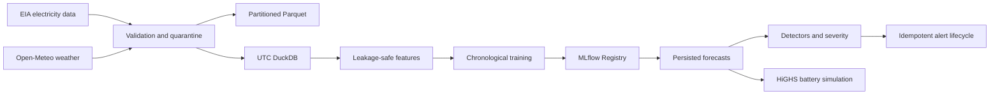
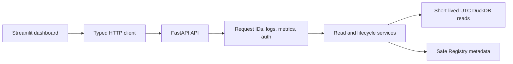

# Architecture

GridMind is a local, batch-oriented decision-support system. It separates ingestion, validated
storage, forecasting, anomaly/alert workflows, battery-dispatch simulation, and serving so each
layer can be tested independently.

## Storage and time contract

- UTC is canonical. Storage helpers set each DuckDB connection to UTC and normalize read timestamps.
- Processed Parquet directories contain canonical Parquet observations only; reports and quarantines
  live outside them.
- Storage writes are idempotent on each domain’s natural key.
- Missing actual demand is either reported as an error or quarantined and excluded; it is never
  interpolated.

## Serving boundary

Routes contain no SQL. Services parameterize their own database queries. The API is read-oriented:
it does not ingest data, train models, trigger live optimization, execute arbitrary SQL, or control
physical infrastructure.

## Operational boundaries

The project is intentionally local-first. DuckDB and SQLite MLflow are appropriate for local or
single-writer use, not distributed concurrent production workloads. Production deployment requires
external identity, TLS, secret management, backups, network policies, and operational monitoring.
